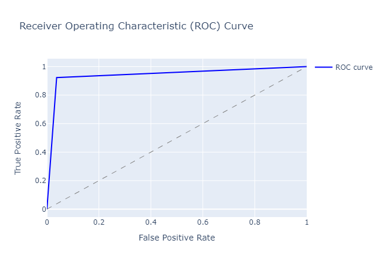

## Pokemon Stats Analysis and ML Project

[Link to Tableau Dashboard](https://public.tableau.com/views/pokemon_16807219032990/PokemonAnalysisDashboard?:language=en-US&publish=yes&:display_count=n&:origin=viz_share_link)

This is a data analysis and machine learning project that focuses on analyzing the stats of Pokemon from the popular Pokemon game series. The project utilizes Python and various data analysis libraries, including Pandas, Numpy, Seaborn, and Matplotlib, to explore and visualize the data, as well as perform statistical analysis on the Pokemon stats.

[View on Google Colab](https://colab.research.google.com/drive/1aE61ea_nG6HwBX7OQRavFV3GiZJdNOHi?usp=sharing)

### Exploratory Data Analysis
The project performs an exploratory data analysis (EDA) on the Pokemon data to gain insights and understand the structure of the data. This includes checking for null values and data types using the info() function, calculating the percentage of null values using the isnull().mean() function, and displaying summary statistics of the data using the describe() function.

### Statistical Analysis
The project performs statistical analysis on the Pokemon data to calculate various statistics, including the mean, median, and standard deviation of different attributes such as Attack, Defense, HP, and Speed.

#### Statistical Analysis Results

I conducted a t-test to compare the Attack stat between different generations of Pokemon. The results are as follows:

Generation 1 vs. Generation 2:

* t-statistic: 1.1763035045816723
* p-value: 0.24050968418101457

Based on a significance level of 0.05, we do not have enough evidence to reject the null hypothesis, as the p-value (0.24050968418101457) is greater than the significance level. Therefore, there is no statistically significant difference in the Attack stat between Generation 1 and Generation 2 of Pokemon.

Generation 1 vs. Generation 3:

* t-statistic: -1.333905980818188
* p-value: 0.18317154297248378

Similarly, for Generation 1 vs. Generation 3, we do not have enough evidence to reject the null hypothesis, as the p-value (0.18317154297248378) is greater than the significance level of 0.05. Therefore, there is no statistically significant difference in the Attack stat between Generation 1 and Generation 3 of Pokemon.

Conclusion:

These results suggest that there is no significant difference in the Attack stat between the different generations of Pokemon based on the conventional significance level of 0.05 commonly used in hypothesis testing. 

### Data Visualizations
The project uses data visualizations to explore the relationships between different variables and to visualize the distributions of Pokemon stats. This includes creating pair plots using the pairplot() function from Seaborn, creating boxplots and scatter plots using the boxplot() and regplot() functions from Seaborn, and creating heatmaps using the heatmap() function from Seaborn.

The project also groups the Pokemon data by 'Type 1' and 'Type 2' and calculates the statistical averages for different attributes. It then creates barplots to visualize the average Pokemon stats for each type.

As we can see with this box plot our stats are fairly evenly distributed with most IQRs ranging from 50-100. We can also see the HP as the most amount of outliers but also has the smallest "maxiumum" and "IQR"

With the chart we can see that there is a positive linear relationship between Attack and Defense

Here are the results from our correlation matrix

Below are the average stats compared across the primary and secondary pokemon types

#### Some additional Findings

### Predictive Analysis using Machine Learning

In this section, we use machine learning to predict whether a Pokemon is legendary based on its stats. We used a variety of models to determine which one performed the best, and then fine-tuned that model using hyperparameter tuning. Finally, we evaluated the performance of the final model using ROC AUC score.

#### Preprocessing
First, we preprocessed our data. We used a pipeline to preprocess both our numerical and categorical data. For the numerical data, we used a SimpleImputer to fill in any missing values with the mean and a StandardScaler to scale the data. For the categorical data, we used a SimpleImputer to fill in any missing values with an empty string and a OneHotEncoder to encode the data.

#### Model Selection
We compared the performance of four models: SVC, LogisticRegression, RandomForestClassifier, and XGBClassifier. We split the data into training and testing sets, fit each model to the training set, and then evaluated their performance on the testing set using accuracy score. We selected the XGBClassifier as our model as it had acheived the greatest accuracy of 0.96.

#### Hyperparameter Tuning
We fine-tuned our selected model using hyperparameter tuning with GridSearchCV. We defined a hyperparameter grid to search over and used cross-validation to find the best combination of hyperparameters. We then trained our model using the best hyperparameters.

#### Model Evaluation

Our model achieves an ROC AUC score of 0.943, indicating good performance in distinguishing between legendary and non-legendary Pokemon. We can also see from the ROC curve plot that our model's TPR is relatively high across a range of FPR values, suggesting that it is able to classify positive instances (legendary Pokemon) with good sensitivity while maintaining a low false positive rate.